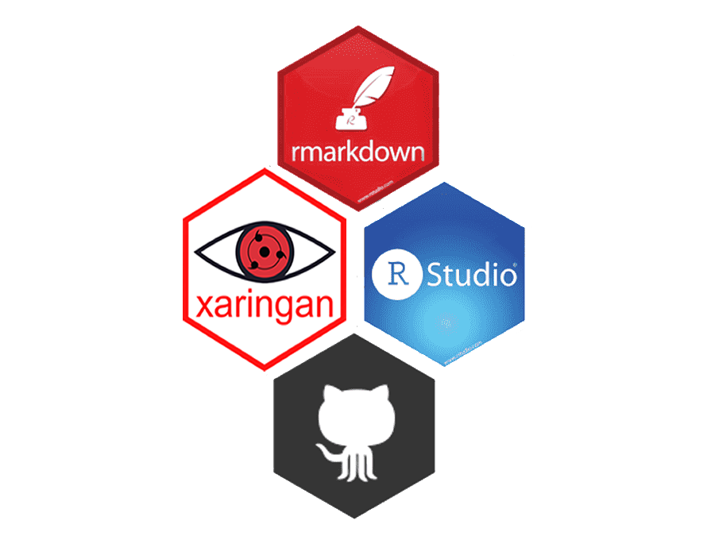

  

    <h1 style="margin: 0; font-size: 2.5em; color: #ff4500;">Apresentação Pi</h1>
    
Fatec Araras

    
`r Sys.Date()`

  

      
Grupo 02

  

    
  

---
<!---início-Logos-topo-da-pagina---->

  

     
  

  
<!--largura-width----> <!--Altura-height--->
    
  

<!---fim-Logos-topo-da-pagina---->

                        <!--largura--> <!--Altura-->
    

---
<!---início-Logos-topo-da-pagina---->

  

     
  

  
<!--largura-width--> <!-----Altura-height--->
    
  

<!---fim-Logos-topo-da-pagina---->

---
<!---início-Logos-topo-da-pagina---->

  

     
  

  
<!--largura-width--> <!-----Altura-height--->
    
  

<!---fim-Logos-topo-da-pagina---->

                        <!--largura--> <!--Altura-->
    

---
<!---início-Logos-topo-da-pagina---->

  

     
  

  
<!--largura-width--> <!-----Altura-height--->
    
  

<!---fim-Logos-topo-da-pagina---->

                        <!--largura--> <!--Altura-->
    

---
#  Muito obrigado !

- Informações úteis

[whatsapp](https://bit.ly/3uMmzeI)

[Github do grupo-02](https://github.com/Lucas-Ed/grupo-02_pi)

---
### Tecnologias utilizadas para esta apresentação: 

    

