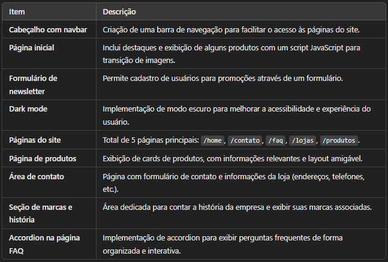

  

    <h1 style="margin: 0; font-size: 2.5em; color: #ff4500;">Apresentação Pi</h1>
    
Fatec Araras

    
2024-12-04
 <!-- Pode substituir por  `r Sys.Date()` para a data automática no Rmarkdown -->
    
Grupo 02

  

  

    
  

---
<!--------Slide--0-2-------------------->
<!---------Integrantes--------------------->

<!---início-Logos-topo-da-pagina---->

  

     
  

  
<!--largura-width----> <!--Altura-height--->
    
  

<!---fim-Logos-topo-da-pagina---->

# Integrantes

<a href="https://linktr.ee/lucas.007" style="text-decoration: underline;">Lucas Eduardo</a>
 

<a href="https://github.com/Marques894" style="text-decoration: underline;">Renan Augusto</a>
 

<a href="https://github.com/Jefferson434" style="text-decoration: underline;">Jeferson Felipe</a>
 

<a href="https://github.com/willsf2021" style="text-decoration: underline;">Wilson Pereira</a>
 

<a href="https://github.com/BFerreiraCardoso" style="text-decoration: underline;">Bruna Ferreira</a>
 

<a href="https://github.com/FlpRocha236" style="text-decoration: underline;">Felipe  Rocha</a>
 

---
<!--------Slide--03--------------------->
<!---------site-atual-da-empresa--------------------->
<!---início-Logos-topo-da-pagina---->

  

     
  

  
<!--largura-width--> <!-----Altura-height--->
    
  

<!---fim-Logos-topo-da-pagina---->

<!-- imagem-->

    

---
<!--------Slide--0-4-------------------->
<!---------introdução-e-objetivo------------------->
<!---início-Logos-topo-da-pagina---->

  

     
  

  
<!--largura-width--> <!-----Altura-height--->
    
  

<!---fim-Logos-topo-da-pagina---->

# Introdução

<h2 style="color: black;"> Nossa proposta:</h2>
<a>- "Rebranding" do Site da Loja Casa Sônia calçados.</a>
 

<h2 style="color: black;"> O objetivo:</h2>
<a>Atualizar o layout do site da empresa, promovendo uma experiência mais agradável ao cliente.</a>
 

<h2 style="color: black;"> O que nossa proposta resolve ?</h2>
<a> Atualizar a imagem digital da Empresa.</a>

---
<!--------Slide--05--------------------->
<!---------escopo--------------------->
<!---início-Logos-topo-da-pagina---->

  

     
  

  
<!--largura-width--> <!-----Altura-height--->
    
  

<!---fim-Logos-topo-da-pagina---->

# Escopo:

<h3 style="color: black;">Estrutura e Funcionalidades de Interfaces</h3>

<!-- Foto centralizada -->

  

---
<!--------Slide--06--------------------->
<!---------escopo-2-------------------->
<!---início-Logos-topo-da-pagina---->

  

     
  

  
<!--largura-width--> <!-----Altura-height--->
    
  

<!---fim-Logos-topo-da-pagina---->

<h3 style="color: black;">Backend e Integrações</h3>

<!-- Foto centralizada -->

  

---
<!--------Slide--0-7-------------------->
<!---------Requisitos-FUN-------------------->

<!---início-Logos-topo-da-pagina---->

  

     
  

  
<!--largura-width--> <!-----Altura-height--->
    
  

<!---fim-Logos-topo-da-pagina---->

# Requisitos Funcionais

<!-- Foto centralizada -->

  

---
<!--------Slide--0-8-------------------->
<!---------Requisitos-FUN-------------------->

<!---início-Logos-topo-da-pagina---->

  

     
  

  
<!--largura-width--> <!-----Altura-height--->
    
  

<!---fim-Logos-topo-da-pagina---->

<!-- Foto centralizada -->

  

---
<!--------Slide--0-9-------------------->
<!---------Requisitos--Ñ--FUN-------------------->

<!---início-Logos-topo-da-pagina---->

  

     
  

  
<!--largura-width--> <!-----Altura-height--->
    
  

<!---fim-Logos-topo-da-pagina---->

# Requisitos Não Funcionais

<!-- Foto centralizada -->

  

---
<!--------Slide--10-------------------->
<!---------Arquitetura de Software-------------------->

<!---início-Logos-topo-da-pagina---->

  

     
  

  
<!--largura-width--> <!-----Altura-height--->
    
  

<!---fim-Logos-topo-da-pagina---->

# Modelagem do Software

<h2 style="color: black;"> Diagramas UML:</h2>
 
<a> - Casos de uso</a>
 
<a> - Contexto</a>
 
<a> - Sequência</a>
 
<a> - Atividades</a>
---
<!--------Slide--11-------------------->
<!---------Arquitetura de Software--casos-de-uso------------------>

<!---início-Logos-topo-da-pagina---->

  

     
  

  
<!--largura-width--> <!-----Altura-height--->
    
  

<!---fim-Logos-topo-da-pagina---->

# Diagrama de casos de uso

<!-- Foto centralizada -->

  

---
<!--------Slide--12--------------------->
<!---------Arquitetura de Software--contexto------------------>

<!---início-Logos-topo-da-pagina---->

  

     
  

  
<!--largura-width--> <!-----Altura-height--->
    
  

<!---fim-Logos-topo-da-pagina---->

# Diagrama de contexto

<!-- Foto centralizada -->

  

---
<!--------Slide--13-------------------->
<!---------Arquitetura de Software--Sequência------------------>

<!---início-Logos-topo-da-pagina---->

  

     
  

  
<!--largura-width--> <!-----Altura-height--->
    
  

<!---fim-Logos-topo-da-pagina---->

# Diagrama de Sequência

<!-- Foto centralizada -->

  

---
<!--------Slide--14-------------------->
<!---------Arquitetura de Software--Atividades------------------>

<!---início-Logos-topo-da-pagina---->

  

     
  

  
<!--largura-width--> <!-----Altura-height--->
    
  

<!---fim-Logos-topo-da-pagina---->

# Diagrama de Atividade

<!-- Foto centralizada -->

  

---
<!--------Slide--15-------------------->
<!---------Metodologia de Desenvolvimento------------------>

<!---início-Logos-topo-da-pagina---->

  

     
  

  
<!--largura-width--> <!-----Altura-height--->
    
  

<!---fim-Logos-topo-da-pagina---->

# Metodologia Ágil ( Scrum )

<!-- Foto centralizada -->

 

---
<!--------Slide--16------------------>
<!---------Metodologia de Desenvolvimento------------------>

<!---início-Logos-topo-da-pagina---->

  

     
  

  
<!--largura-width--> <!-----Altura-height--->
    
  

<!---fim-Logos-topo-da-pagina---->

<a>Benefícios da metodologia escolhida para o projeto.</a>
 

<!-- Foto centralizada -->

  

---
<!--------Slide--17--------------------->
<!---------Prototipação--------------------->
<!---início-Logos-topo-da-pagina---->

  

     
  

  
<!--largura-width--> <!-----Altura-height--->
    
  

<!---fim-Logos-topo-da-pagina---->

# Prototipação

<h2 style="color: black;">Ferramentas utilizadas para prototipagem</h2>
<!-- Imagem -->

  

---
<!--------Slide--18--------------------->
<!---------Prototipação--branding------------------>
<!---início-Logos-topo-da-pagina---->

  

     
  

  
<!--largura-width--> <!-----Altura-height--->
    
  

<!---fim-Logos-topo-da-pagina---->

<!-- Foto centralizada -->

  

---
<!--------Slide--19--------------------->
<!---------Prototipação--principais--telas-1------------------>
<!---início-Logos-topo-da-pagina---->

  

     
  

  
<!--largura-width--> <!-----Altura-height--->
    
  

<!---fim-Logos-topo-da-pagina---->

<!------------imagens----------------------->

  
  

---
<!--------Slide--20-------------------->
<!---------Prototipação--principais--telas-faq-fechada------------------>
<!---início-Logos-topo-da-pagina---->

  

     
  

  
<!--largura-width--> <!-----Altura-height--->
    
  

<!---fim-Logos-topo-da-pagina---->

<!------------imagens----------------------->

  
  

---
<!--------Slide--21-------------------->
<!---------Prototipação--principais--telas-produtos------------------>
<!---início-Logos-topo-da-pagina---->

  

     
  

  
<!--largura-width--> <!-----Altura-height--->
    
  

<!---fim-Logos-topo-da-pagina---->

<!------------imagens----------------------->

  
  

---
<!--------Slide--22-------------------->
<!---------Prototipação--principais--tela- contato------------------>
<!---início-Logos-topo-da-pagina---->

  

     
  

  
<!--largura-width--> <!-----Altura-height--->
    
  

<!---fim-Logos-topo-da-pagina---->

<!------------imagens----------------------->

  
  

---
<!--------Slide--23-------------------->
<!---------Prototipação--principais--tela- contato------------------>
<!---início-Logos-topo-da-pagina---->

  

     
  

  
<!--largura-width--> <!-----Altura-height--->
    
  

<!---fim-Logos-topo-da-pagina---->

<!------------imagens----------------------->

  
  

---
<!--------Slide--24--------------------->
<!---------Prototipação--------------------->
<!---início-Logos-topo-da-pagina---->

  

     
  

  
<!--largura-width--> <!-----Altura-height--->
    
  

<!---fim-Logos-topo-da-pagina---->

<!-- GIF centralizado -->

  

---
<!--------Slide--25--------------------->
<!---------Codificação--------------------->
<!---início-Logos-topo-da-pagina---->

  

     
  

  
<!--largura-width--> <!-----Altura-height--->
    
  

<!---fim-Logos-topo-da-pagina---->

# Codificação

    

---

<!--------Slide--26--------------------->
<!---------Plano de Testes--------------------->
<!---início-Logos-topo-da-pagina---->

  

     
  

  
<!--largura-width--> <!-----Altura-height--->
    
  

<!---fim-Logos-topo-da-pagina---->

# Plano de Testes

    

---
<!--------Slide--27--------------------->
<!---------Implantação e Manutenção--------------------->
<!---início-Logos-topo-da-pagina---->

  

     
  

  
<!--largura-width--> <!-----Altura-height--->
    
  

<!---fim-Logos-topo-da-pagina---->

# Manutenção

<h2 style="color: black;"> Plano de manutenção:</h2>
<a> Frequência Mensal</a>
 
<a> - Verificação de atualizações de segurança nas bibliotecas utilizadas.</a>
 
<a> - Análise de desempenho da aplicação para identificar possíveis melhorias. </a>
 
<a> - Atualização de Backup do banco de dados.</a>
 
<h2 style="color: black;"> Manutenção Corretiva:</h2>
<a> Frequência Sob Demanda.</a>
 
<a> - Correção de bugs e erros reportados pelos usuários, como links quebrados ou formulários com problemas.</a>
 
<a> - Ajustes de layout, como problemas com a navbar, dark mode, ou problemas de exibição no carrossel de produtos.  </a>
 
<a> - Teste de compatibilidade com novos navegadores e versões de navegadores existentes.</a>
 

---
<!--------Slide--28--------------------->
<!---------Plano de suporte--------------------->
<!---início-Logos-topo-da-pagina---->

  

     
  

  
<!--largura-width--> <!-----Altura-height--->
    
  

<!---fim-Logos-topo-da-pagina---->

<h1 style="color: black;">Plano de suporte:</h1>

 
<a> - Canais de Suporte: Chat direto via WhatsApp.</a>
 
 
<a> - Disponibilidade: Horário comercial. </a>
 
 
<a> - Equipe responsável, equipe de desenvolvimento e manutenção do site. </a>

---
<!--------Slide--29--------------------->
<!---------Evolução--------------------->
<!---início-Logos-topo-da-pagina---->

  

     
  

  
<!--largura-width--> <!-----Altura-height--->
    
  

<!---fim-Logos-topo-da-pagina---->

# Evolução

<h2 style="color: black;"> Plano de evolução:</h2>

O plano de evolução incluí futuras melhorias e funcionalidades adicionais, como:

 
<a> - Formulário de busca de produtos.</a>
 
 
<a> - Implementação de um sistema de e-commerce.</a>
 
 
<a> - Sugestão de compras de acordo com produtos já adquiridos pelo cliente. </a>
 
 
<a> - Adição de novas categorias de produtos conforme a demanda. </a>
 
 
<a>- Melhoria na API, implementando restrições usando “cors”, para somente permitir requisições de domínios autorizados, visando proteger o banco de dados.</a>

---
<!--------Slide-30-------->
<!-------Links-------------->
<!---início-Logos-topo-da-pagina---->

  

     
  

  
<!--largura-width--> <!-----Altura-height--->
    
  

<!---fim-Logos-topo-da-pagina---->

#  Links úteis

<a href="https://www.figma.com/design/sIfEtyseMbpBPBKTnMTnAm/Casa-S%C3%B4nia-Fashion?node-id=0-88&t=xCCDPaCHfE8gytH9-1" style="text-decoration: underline;">Layout do projeto do Pi.</a>
 

<a href="https://trello.com/invite/b/670a36ac9fdfb633bd12bc42/ATTIc0bd37a0dad55feb71e78e437d7367886CFD379C/fatec-pi-documentacao-casa-sonia-fashion" style="text-decoration: underline;">Métodologia para gestão de tarefas do Pi.</a>
 

<a href="https://casasonia.com.br" style="text-decoration: underline;">Site atual da empresa.</a>
 
 
<a href="https://csfashion-pi.netlify.app/" style="text-decoration: underline;">Deploy da aplicação do projeto proposto pelo Pi.</a>
 
 
<a href="https://github.com/Lucas-Ed/Backend_grupo02_pi" style="text-decoration: underline;">Repositório da Api.</a>
 
 
<a href="https://github.com/Lucas-Ed/grupo-02_pi" style="text-decoration: underline;">Github do grupo-02</a>
 
 
<a href="https://github.com/Lucas-Ed/grupo-02_pi/blob/main/Documentação/PI%20-%20Documentação.pdf" style="text-decoration: underline;">Documentação </a>

---
<!--------Slide31------>
<!----Tecnologias da Apn-------->
<!---início-Logos-topo-da-pagina---->

  

     
  

  
<!--largura-width--> <!-----Altura-height--->
    
  

<!---fim-Logos-topo-da-pagina---->

<h2  style="color: black;"> Tecnologias utilizadas para esta apresentação: </h2>

    

---
<!--------Slide--32--------------------->
<!---------Perguntas--------------------->
<!---início-Logos-topo-da-pagina---->

  

     
  

  
<!--largura-width--> <!-----Altura-height--->
    
  

<!---fim-Logos-topo-da-pagina---->

<h1 style=" margin-left: 100px; margin-top: 100px;">Fim !
 <h1>Muito Obrigado !!!</h1></p</h1>

---
<!--------Slide--33--------------------->
<!---------Perguntas--------------------->
<!---início-Logos-topo-da-pagina---->

  

     
  

  
<!--largura-width--> <!-----Altura-height--->
    
  

<!---fim-Logos-topo-da-pagina---->

<h1 style=" margin-left: 250px; margin-top: 250px;"> Perguntas ???</h1> 

