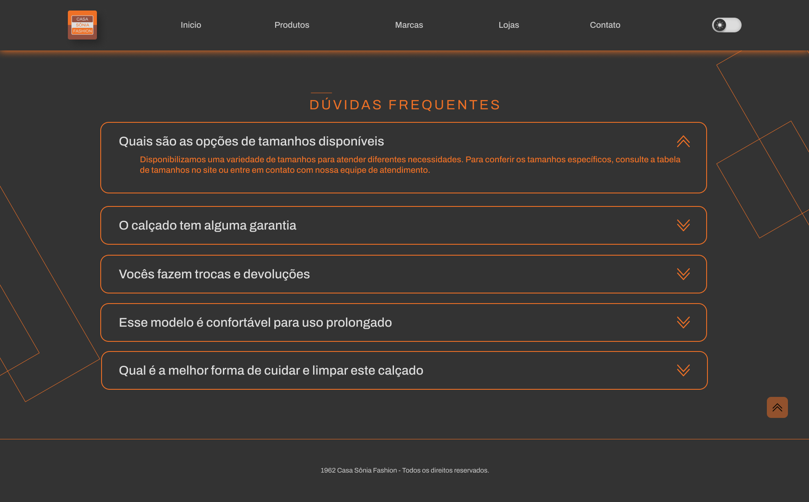

  

    <h1 style="margin: 0; font-size: 2.5em; color: #ff4500;">Apresentação Pi</h1>
    
Fatec Araras

    
`r Sys.Date()`
 <!-- Pode substituir por 2024-10-29 para a data automática no Rmarkdown -->
    
Grupo 02

  

  

    
  

---
<!--------Slide--0-2-------------------->
<!---------Colaboradores--------------------->

<!---início-Logos-topo-da-pagina---->

  

     
  

  
<!--largura-width----> <!--Altura-height--->
    
  

<!---fim-Logos-topo-da-pagina---->

# Colaboradores

[Lucas Eduardo ](linktr.ee/lucas.007)

[Renan Augusto](https://github.com/Marques894)

[Jeferson Felipe](https://github.com/Jefferson434)

[Wilson Pereira](https://github.com/willsf2021)

[Bruna Ferreira](https://github.com/BFerreiraCardoso)

[Felipe  Rocha](https://github.com/FlpRocha236)

---
<!--------Slide--0-3-------------------->
<!---------introdução--------------------->
<!---início-Logos-topo-da-pagina---->

  

     
  

  
<!--largura-width--> <!-----Altura-height--->
    
  

<!---fim-Logos-topo-da-pagina---->

# Introdução

<a>Título do Projeto
Objetivo da Apresentação: breve introdução sobre o que será discutido e a importância do projeto.</a>

---
<!--------Slide--0-4-------------------->
<!---------Objetivo--------------------->
<!---início-Logos-topo-da-pagina---->

  

     
  

  
<!--largura-width--> <!-----Altura-height--->
    
  

<!---fim-Logos-topo-da-pagina---->

<a>Descrição breve do objetivo principal do projeto.
Destaque: problema que o software resolve e os benefícios esperados.</a>
---
<!--------Slide--0-5-------------------->
<!---------Escopo do Projeto--------------------->
<!---início-Logos-topo-da-pagina---->

  

     
  

  
<!--largura-width--> <!-----Altura-height--->
    
  

<!---fim-Logos-topo-da-pagina---->

# Escopo do Projeto

<a>

- Cabeçalho com navbar

- Página inicial com destaques e alguns produtos usando um script js, para transcorrer as imagens .

- Formulário de newsletter para cadastro de usuário para promoções.

- Dark mode.

- O software terá 3 páginas-(Home/ Faq/ Produtos).

- Cards que contém alguns produtos disponíveis para compra com botões que redirecionam o usuário ao WhatsApp.

- Área de contato e informações da loja.

</a>
---
<!--------Slide--0-6-------------------->
<!---------Descrição do Software--------------------->

<!---início-Logos-topo-da-pagina---->

  

     
  

  
<!--largura-width--> <!-----Altura-height--->
    
  

<!---fim-Logos-topo-da-pagina---->

# Descrição do Software
<a>Visão Geral: como o software funciona e para que é destinado.
Público-Alvo: quem são os usuários ou clientes potenciais.</a>
---
<!--------Slide--0-7-------------------->
<!---------Requisitos-FUN-------------------->

<!---início-Logos-topo-da-pagina---->

  

     
  

  
<!--largura-width--> <!-----Altura-height--->
    
  

<!---fim-Logos-topo-da-pagina---->

# Requisitos
<a>Explicação rápida do Levantamento de Requisitos (LR).

Requisitos Funcionais (RF): principais funcionalidades do sistema.</a>

---
<!--------Slide--0-8-------------------->
<!---------Requisitos--Ñ--FUN-------------------->

<!---início-Logos-topo-da-pagina---->

  

     
  

  
<!--largura-width--> <!-----Altura-height--->
    
  

<!---fim-Logos-topo-da-pagina---->

<a>Requisitos Não Funcionais (RNF): aspectos de desempenho, segurança, etc.</a>
---
<!--------Slide--0-9-------------------->
<!---------Arquitetura de Software-------------------->

<!---início-Logos-topo-da-pagina---->

  

     
  

  
<!--largura-width--> <!-----Altura-height--->
    
  

<!---fim-Logos-topo-da-pagina---->

# Arquitetura de Software

<a>Breve introdução à arquitetura usada.
Diagramas UML: apresentar de forma visual, com os diagramas mais relevantes, como:
Diagrama de Casos de Uso (resumir casos principais)</a>
---
<!--------Slide--10-01-------------------->
<!---------Arquitetura de Software--casos-de-uso------------------>

<!---início-Logos-topo-da-pagina---->

  

     
  

  
<!--largura-width--> <!-----Altura-height--->
    
  

<!---fim-Logos-topo-da-pagina---->

# Diagrama de casos de uso

<!-- Foto centralizada -->

  

---
<!--------Slide--10-02-------------------->
<!---------Arquitetura de Software--contexto------------------>

<!---início-Logos-topo-da-pagina---->

  

     
  

  
<!--largura-width--> <!-----Altura-height--->
    
  

<!---fim-Logos-topo-da-pagina---->

# Diagrama de contexto

<!-- Foto centralizada -->

  

---
<!--------Slide--10-03-------------------->
<!---------Arquitetura de Software--Sequência------------------>

<!---início-Logos-topo-da-pagina---->

  

     
  

  
<!--largura-width--> <!-----Altura-height--->
    
  

<!---fim-Logos-topo-da-pagina---->

# Diagrama de Sequência

<!-- Foto centralizada -->

  

---
<!--------Slide--10-04-------------------->
<!---------Arquitetura de Software--Atividades------------------>

<!---início-Logos-topo-da-pagina---->

  

     
  

  
<!--largura-width--> <!-----Altura-height--->
    
  

<!---fim-Logos-topo-da-pagina---->

# Diagrama de Atividade

<!-- Foto centralizada -->

  

---
<!--------Slide--14-------------------->
<!---------Metodologia de Desenvolvimento------------------>

<!---início-Logos-topo-da-pagina---->

  

     
  

  
<!--largura-width--> <!-----Altura-height--->
    
  

<!---fim-Logos-topo-da-pagina---->

# Metodologia Ágil ( Scrum )

<!-- Foto centralizada -->

  

---
<!--------Slide--15------------------->
<!---------Metodologia de Desenvolvimento------------------>

<!---início-Logos-topo-da-pagina---->

  

     
  

  
<!--largura-width--> <!-----Altura-height--->
    
  

<!---fim-Logos-topo-da-pagina---->

<a>Benefícios da metodologia escolhida para o projeto.</a>
---
<!--------Slide--16--------------------->
<!---------Prototipação--------------------->
<!---início-Logos-topo-da-pagina---->

  

     
  

  
<!--largura-width--> <!-----Altura-height--->
    
  

<!---fim-Logos-topo-da-pagina---->

# Prototipação

# Ferramentas utilizadas para prototipagem
<!-- GIF centralizado -->

  

---
<!--------Slide--17--------------------->
<!---------Prototipação--branding------------------>
<!---início-Logos-topo-da-pagina---->

  

     
  

  
<!--largura-width--> <!-----Altura-height--->
    
  

<!---fim-Logos-topo-da-pagina---->

<!-- Foto centralizada -->

  

---
<!--------Slide--18--------------------->
<!---------Prototipação--principais--telas-1------------------>
<!---início-Logos-topo-da-pagina---->

  

     
  

  
<!--largura-width--> <!-----Altura-height--->
    
  

<!---fim-Logos-topo-da-pagina---->

<!------------imagens----------------------->

  
  

---
<!--------Slide--19-------------------->
<!---------Prototipação--principais--telas-faq-fechada------------------>
<!---início-Logos-topo-da-pagina---->

  

     
  

  
<!--largura-width--> <!-----Altura-height--->
    
  

<!---fim-Logos-topo-da-pagina---->

<!------------imagens----------------------->

  
  

---
<!--------Slide--20-------------------->
<!---------Prototipação--principais--telas-faq-aberta------------------>
<!---início-Logos-topo-da-pagina---->

  

     
  

  
<!--largura-width--> <!-----Altura-height--->
    
  

<!---fim-Logos-topo-da-pagina---->

<!------------imagens----------------------->

  
  

---
<!--------Slide--21-------------------->
<!---------Prototipação--principais--telas-produtos------------------>
<!---início-Logos-topo-da-pagina---->

  

     
  

  
<!--largura-width--> <!-----Altura-height--->
    
  

<!---fim-Logos-topo-da-pagina---->

<!------------imagens----------------------->

  
  

---
<!--------Slide--22--------------------->
<!---------Prototipação--------------------->
<!---início-Logos-topo-da-pagina---->

  

     
  

  
<!--largura-width--> <!-----Altura-height--->
    
  

<!---fim-Logos-topo-da-pagina---->

<!-- GIF centralizado -->

  

---
<!--------Slide--23--------------------->
<!---------Codificação--------------------->
<!---início-Logos-topo-da-pagina---->

  

     
  

  
<!--largura-width--> <!-----Altura-height--->
    
  

<!---fim-Logos-topo-da-pagina---->

# Codificação
<a>
Ambiente de Desenvolvimento (ferramentas, IDEs utilizadas).
Procedimentos de Desenvolvimento: boas práticas de código, estrutura dos arquivos.</a>
---
<!--------Slide--24--------------------->
<!---------Implementação--------------------->
<!---início-Logos-topo-da-pagina---->

  

     
  

  
<!--largura-width--> <!-----Altura-height--->
    
  

<!---fim-Logos-topo-da-pagina---->

# Implementação

<a>Controle de Versionamento: mencionar o uso do GitHub, principais práticas de versionamento.
Hospedagem: descrição do processo de hospedagem no Vercel e por que ele foi escolhido.</a>

---
<!--------Slide--25--------------------->
<!---------Plano de Testes--------------------->
<!---início-Logos-topo-da-pagina---->

  

     
  

  
<!--largura-width--> <!-----Altura-height--->
    
  

<!---fim-Logos-topo-da-pagina---->

# Plano de Testes

<a>Estratégia de Testes: testes realizados (unitários, integração, etc.).
Casos de Teste: breve menção a alguns cenários de teste críticos..</a>

---
<!--------Slide--26--------------------->
<!---------Implantação e Manutenção--------------------->
<!---início-Logos-topo-da-pagina---->

  

     
  

  
<!--largura-width--> <!-----Altura-height--->
    
  

<!---fim-Logos-topo-da-pagina---->

# Implantação e Manutenção

<a>Ambiente de Implantação: onde e como o software será disponibilizado.
Procedimentos de Implantação: passos seguidos para colocar em produção.
Plano de Manutenção e Suporte: como serão feitas as correções e atualizações.</a>

---
<!--------Slide--27--------------------->
<!---------Evolução--------------------->
<!---início-Logos-topo-da-pagina---->

  

     
  

  
<!--largura-width--> <!-----Altura-height--->
    
  

<!---fim-Logos-topo-da-pagina---->

# Evolução

<a>Histórico de Versões: principais atualizações e melhorias.
Plano de Evolução: novas funcionalidades planejadas para o futuro, objetivos de expansão..</a>

---
<!--------Slide--27--------------------->
<!---------Conclusão e Próximos Passos--------------------->
<!---início-Logos-topo-da-pagina---->

  

     
  

  
<!--largura-width--> <!-----Altura-height--->
    
  

<!---fim-Logos-topo-da-pagina---->

# Conclusão e Próximos Passos

<a>Resumo dos principais pontos do projeto.
Próximos passos para a evolução do software.
Espaço para perguntas e discussão</a>
---
<!---início-Logos-topo-da-pagina---->

  

     
  

  
<!--largura-width--> <!-----Altura-height--->
    
  

<!---fim-Logos-topo-da-pagina---->
#  Muito obrigado !

- Informações úteis

[whatsapp](https://bit.ly/3uMmzeI)

[Github do grupo-02](https://github.com/Lucas-Ed/grupo-02_pi)

---
<!---início-Logos-topo-da-pagina---->

  

     
  

  
<!--largura-width--> <!-----Altura-height--->
    
  

<!---fim-Logos-topo-da-pagina---->

### Tecnologias utilizadas para esta apresentação: 

    

